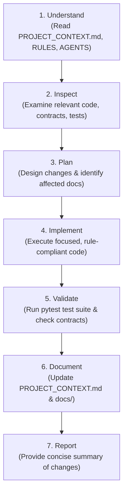

# AGENTS.md — AI Agent Operating Instructions

> **CRITICAL DIRECTIVE:** This document is the persistent operational guide for all AI coding agents working on the **QNetra** repository. Every agent must adhere strictly to these rules across every interaction.

---

## 1. Core Operating Philosophy

QNetra is developed using a **Living Single Source of Truth** documentation model. Code and documentation must never drift apart. A task is **NOT complete** until all affected documentation files are updated and verified.

---

## 2. Rule Hierarchy

When resolving conflicting requirements or ambiguities, always follow this strict precedence hierarchy:

```
1. Explicit User Instructions for the current task
   ↓
2. PROJECT_RULES.md (Active project constraints & governance)
   ↓
3. AGENTS.md (Operational instructions & documentation workflows)
   ↓
4. Existing Architecture & Data Contracts (docs/02_SYSTEM_ARCHITECTURE.md & docs/06_API_AND_DATA_CONTRACTS.md)
   ↓
5. Existing Module Documentation (docs/04_MODULES.md)
   ↓
6. General implementation preferences / best practices
```

> [!WARNING]
> If a user instruction or sub-task directly conflicts with an existing rule in `PROJECT_RULES.md` or a shared data contract in `docs/06_API_AND_DATA_CONTRACTS.md`, **explicitly highlight the conflict** to the user and request confirmation before proceeding.

---

## 3. Before Starting Work (Mandatory Pre-Flight Protocol)

Before executing any code changes or proposing designs, every agent must execute the following 5-step discovery sequence:

```text
1. Read PROJECT_CONTEXT.md    (High-density architecture snapshot, current status, implemented features, handoff notes)
        ↓
2. Read PROJECT_RULES.md      (Active engineering rules, architectural constraints, and coding standards)
        ↓
3. Read AGENTS.md             (Operational guide, document monitoring responsibilities, 7-step loop)
        ↓
4. Read Task-Specific Docs    (Consult /docs files ONLY as needed for the assigned task)
        ↓
5. Inspect Target Code/Models (Inspect only the modules, dependencies, and tests relevant to the current task)
```

### Discovery Documents Reference:
* High-density status & architecture snapshot: [PROJECT_CONTEXT.md](PROJECT_CONTEXT.md)
* Comprehensive current project status & health: [current_status.md](current_status.md)
* Active engineering constraints & governance: [PROJECT_RULES.md](PROJECT_RULES.md)
* Project mission & front door: [README.md](README.md)
* Real-time progress & roadmap: [docs/07_PROGRESS.md](docs/07_PROGRESS.md)
* Architecture & design history: [docs/02_SYSTEM_ARCHITECTURE.md](docs/02_SYSTEM_ARCHITECTURE.md)
* Pipeline transformations: [docs/03_DATA_FLOW.md](docs/03_DATA_FLOW.md)
* Module catalog & status: [docs/04_MODULES.md](docs/04_MODULES.md)
* Algorithms & formulas: [docs/05_ALGORITHMS.md](docs/05_ALGORITHMS.md)
* Shared data schemas & contracts: [docs/06_API_AND_DATA_CONTRACTS.md](docs/06_API_AND_DATA_CONTRACTS.md)
* Architecture decisions: [docs/08_DECISIONS_AND_LOG.md](docs/08_DECISIONS_AND_LOG.md)
* Domain knowledge (PQC/Mosca): [docs/09_KNOWLEDGE_BASE.md](docs/09_KNOWLEDGE_BASE.md)

---

## 4. During Development

While implementing or refactoring code, every agent must:

* **Follow Existing Architecture:** Align with the layered design described in [docs/02_SYSTEM_ARCHITECTURE.md](docs/02_SYSTEM_ARCHITECTURE.md).
* **Respect `PROJECT_RULES.md`:** Never violate active constraints (e.g., dependency rules, schema compatibility, explainability requirements).
* **Avoid Unnecessary Rewrites:** Modify only what is strictly necessary to fulfill the user request. Do not refactor unrelated files.
* **Avoid Incompatible Changes:** Preserve backward compatibility across shared module contracts unless a breaking change is explicitly approved and recorded in [docs/08_DECISIONS_AND_LOG.md](docs/08_DECISIONS_AND_LOG.md).
* **Keep Modules Decoupled:** Scanner modules must remain decoupled from the core analysis engine; analysis engines must remain decoupled from UI/presentation.
* **Adhere to Shared Data Contracts:** All scanner output must normalize into the canonical `CryptoAsset` schema ([docs/06_API_AND_DATA_CONTRACTS.md](docs/06_API_AND_DATA_CONTRACTS.md)).
* **Never Silently Modify Shared Interfaces:** If a schema change is required, document it in `docs/06_API_AND_DATA_CONTRACTS.md` and identify all downstream impact.
* **Prefer Explainable Logic:** Cryptographic risk scores and Mosca calculations must be deterministic and transparent (see [docs/05_ALGORITHMS.md](docs/05_ALGORITHMS.md)).

---

## 5. Continuous Documentation Monitoring Rule

> [!IMPORTANT]
> **Continuous Documentation Responsibility:**
> You must continuously evaluate the impact of your changes on the project documentation and handoff files.
> **DO NOT wait for the user to ask for documentation updates.**
> Updating documentation and maintaining `PROJECT_CONTEXT.md` is an integral requirement of task completion.

Whenever any change is made, evaluate the following checklist:

| Reflection Question | If YES, Action Required | Target Document |
| :--- | :--- | :--- |
| *Did this change advance implementation, complete a milestone, or change next steps?* | **Update current state, implemented list, and next priorities** | [current_status.md](current_status.md), [PROJECT_CONTEXT.md](PROJECT_CONTEXT.md) & [docs/07_PROGRESS.md](docs/07_PROGRESS.md) |
| *Did this change affect system scope or boundaries?* | Update scope, requirements, or traceability | [docs/01_PROJECT_SCOPE.md](docs/01_PROJECT_SCOPE.md) |
| *Did this change modify layers, components, or boundaries?* | Update architecture description, diagrams & change history | [docs/02_SYSTEM_ARCHITECTURE.md](docs/02_SYSTEM_ARCHITECTURE.md) |
| *Did this change alter how data moves through QNetra?* | Update data flow pipeline table & stage breakdown | [docs/03_DATA_FLOW.md](docs/03_DATA_FLOW.md) |
| *Did this change add, modify, or deprecate a module?* | Update module catalog, responsibilities, and status | [docs/04_MODULES.md](docs/04_MODULES.md) |
| *Did this change introduce/modify an algorithm or heuristic?* | Document logic, formulas, assumptions & limitations | [docs/05_ALGORITHMS.md](docs/05_ALGORITHMS.md) |
| *Did this change modify a shared data structure, schema, or API?* | Update schemas, examples, producers, and consumers | [docs/06_API_AND_DATA_CONTRACTS.md](docs/06_API_AND_DATA_CONTRACTS.md) |
| *Did this change involve an important technical/design decision?* | Record an Architecture Decision Record (ADR `DEC-XXX`) | [docs/08_DECISIONS_AND_LOG.md](docs/08_DECISIONS_AND_LOG.md) |
| *Did this change reveal valuable domain insights or standards?* | Add findings, references, and explanations | [docs/09_KNOWLEDGE_BASE.md](docs/09_KNOWLEDGE_BASE.md) |
| *Did this introduce a new project rule or constraint?* | Append new rule with ID and rationalization | [PROJECT_RULES.md](PROJECT_RULES.md) |

---

## 6. Standard Agent Development Workflow (7-Step Loop)

Every agent must follow this systematic 7-step process:



### Step 1: Understand
* Read `PROJECT_CONTEXT.md` first for instant project snapshot, architecture status, and continuation point.
* Review `PROJECT_RULES.md` and `AGENTS.md`.
* Locate task-specific specifications in `/docs` only as needed.

### Step 2: Inspect
* Inspect existing code, file structures, and data models.
* Map all dependencies and interfaces that could be impacted.

### Step 3: Plan
* Formulate an implementation strategy that honors architectural boundaries.
* Determine exactly which documentation files will need updates upon completion.

### Step 4: Implement
* Write clean, idiomatic, well-commented code.
* Stick strictly to the task scope; avoid unprompted refactoring of unrelated subsystems.

### Step 5: Validate
* Execute unit tests, type checks, and schema validation.
* Ensure no regressions were introduced to existing modules.

### Step 6: Document
* Immediately update all affected documentation files identified in the Documentation Matrix.
* Update `docs/07_PROGRESS.md` with completed items and updated next steps.

### Step 7: Report
* Summarize changes concisely for the user:
  * What code changed and why
  * Which documentation files were updated
  * Validation/tests executed
  * Next recommended steps

---

## 7. Multi-Agent & Team Scalability Guidelines

* **Autonomous Context Recovery:** All context necessary to work on the project must be accessible from the repository files. Do not assume prior chat context exists.
* **Atomicity:** When adding a feature, keep the code changes, tests, and documentation updates atomic.
* **Deterministic Decision Recording:** If you make an architectural choice between two viable paths, document it in `docs/08_DECISIONS_AND_LOG.md` so future team members and agents understand the reasoning.
