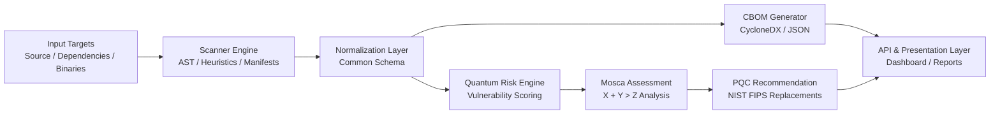

# QNetra — Enterprise Cryptographic Discovery & Analysis Tool (ECDAT)

[](docs/07_PROGRESS.md)
[](docs/09_KNOWLEDGE_BASE.md)
[](docs/06_API_AND_DATA_CONTRACTS.md)

---

## Executive Overview

**QNetra** is an **Enterprise Cryptographic Discovery & Analysis Tool (ECDAT)** engineered to empower organizations with total visibility into their cryptographic footprint. As the advent of Cryptographically Relevant Quantum Computers (CRQCs) approaches, classical public-key cryptography (RSA, ECC, Diffie-Hellman) faces complete obsolescence.

QNetra discovers cryptographic assets across codebases, dependencies, and artifacts, generates standardized **Cryptographic Bills of Materials (CBOM)**, quantifies quantum vulnerability risks, evaluates migration timelines using **Mosca’s Theorem**, and provides actionable **Post-Quantum Cryptography (PQC)** and **Hybrid Migration** roadmaps.

---

## Problem Statement & Threat Landscape

* **Quantum Vulnerability:** Shor's algorithm renders traditional asymmetric cryptography (RSA, DSA, ECDSA, ECDH) insecure against quantum adversaries.
* **Harvest Now, Decrypt Later (HNDL):** Adversaries are actively intercepting and storing encrypted enterprise and national communication today to decrypt once quantum capabilities mature.
* **Cryptographic Blind Spots:** Most enterprises do not have an inventory of where cryptographic primitives, hardcoded keys, legacy cipher suites, or weak algorithms are located in their applications and infrastructure.
* **Complex Migration:** Transitioning to Post-Quantum standards (NIST FIPS 203, 204, 205) requires structured risk prioritization, timeline estimation, and cryptographic agility.

---

## High-Level Objectives

1. **Automated Discovery:** Scan source repositories, package manifests, configuration files, and binaries for cryptographic algorithms, key lengths, and protocols.
2. **CBOM Generation:** Produce standard-compliant Cryptographic Bills of Materials (aligned with CycloneDX 1.6+ crypto extensions).
3. **Quantum Risk Scoring:** Classify cryptographic assets by threat severity, algorithmic vulnerability, and exposure.
4. **Mosca Migration Assessment:** Apply Michele Mosca’s Theorem ($X + Y > Z$) to compute migration urgency and identify critical exposure windows.
5. **PQC & Hybrid Recommendations:** Recommend NIST-standardized PQC replacements (ML-KEM, ML-DSA, SLH-DSA) and hybrid schemes tailored to specific operational contexts.
6. **Executive & Technical Reporting:** Provide interactive dashboards and exportable audit reports for CISOs, security architects, and development teams.

---

## Core System Flow



---

## Main Capabilities

* **Multi-Vector Scanning:** Static code analysis (AST & pattern matching), dependency manifest parsing, and artifact inspection.
* **Universal Normalization:** Converts varied raw scan outputs into a uniform cryptographic asset contract.
* **Standards-Compliant CBOM:** Exportable CBOMs containing algorithm metadata, key sizes, curves, and usage context.
* **Deterministic Risk Scoring:** Objective risk scoring based on Shor/Grover vulnerability, algorithm strength, and key lifetimes.
* **Timeline Simulation:** Interactive Mosca-based slider model calculating vulnerability windows against CRQC projections.
* **Cryptographic Agility Insights:** Pinpoint hardcoded primitives and recommend abstracted crypto-service layers.

---

## Repository Structure Overview

```
QNetra/
│
├── README.md                      # Project front door, overview, and documentation index
├── AGENTS.md                      # Persistent operational guide for AI coding agents
├── PROJECT_RULES.md               # Active project constraints, rules, and governance
│
├── docs/                          # Comprehensive Single Source of Truth documentation
│   ├── 01_PROJECT_SCOPE.md        # Detailed scope, functional requirements, and boundaries
│   ├── 02_SYSTEM_ARCHITECTURE.md  # System layers, component diagrams, and design history
│   ├── 03_DATA_FLOW.md            # End-to-end data transformation pipeline & lifecycle
│   ├── 04_MODULES.md             # Module responsibilities, status, dependencies, and contracts
│   ├── 05_ALGORITHMS.md           # Discovery, risk scoring, Mosca, and recommendation logic
│   ├── 06_API_AND_DATA_CONTRACTS.md # Shared schemas, data structures, and interface definitions
│   ├── 07_PROGRESS.md             # Living task tracking, milestones, and status
│   ├── 08_DECISIONS_AND_LOG.md    # Architecture Decision Records (ADRs) and changelog
│   └── 09_KNOWLEDGE_BASE.md       # Curated domain knowledge (PQC, Mosca, CBOM, HNDL)
│
├── scanners/                      # Implemented Discovery Framework, Registries, & 3 Scanners
│   ├── framework/                 # BaseScanner, ScannerRouter, ScanTarget, ScanResult, RawFinding
│   ├── registry/                  # Curated crypto knowledge (algorithms, libraries, APIs, patterns, symbols)
│   ├── utils/                     # Traversal, language classification, binary string extraction
│   ├── repository/                # Python AST, JS/TS, Java, and C/C++ source code analyzers
│   ├── container/                 # Extracted container filesystem, shared lib, & package inspector
│   └── binary/                    # Static ELF/PE binary scanner (lief symbols + string correlation)
│
├── core/                          # Normalization, CBOM, Risk, Mosca, and Recommendation logic (Phase 2)
├── backend/                       # Backend service & API implementation (Phase 4)
├── frontend/                      # Web dashboard & reporting interface (Phase 4)
├── tests/                         # Full automated test suite (77 tests, 80% coverage)
└── samples/                       # Multi-language cryptographic sample testbeds
```

---

## Documentation Index

| Document | Purpose | Audience | Status |
| :--- | :--- | :--- | :--- |
| [PROJECT_CONTEXT.md](PROJECT_CONTEXT.md) | High-density AI agent handoff document & architecture snapshot | AI Agents & Contributors | **Live Handoff** |
| [AGENTS.md](AGENTS.md) | Operational rules and documentation maintenance instructions for AI agents | AI Agents & Contributors | **Active** |
| [PROJECT_RULES.md](PROJECT_RULES.md) | Enforceable project rules, architecture constraints, and coding standards | All Developers | **Active** |
| [docs/01_PROJECT_SCOPE.md](docs/01_PROJECT_SCOPE.md) | Complete problem scope, in/out of scope boundaries, and MVP definition | All | **Active Specification** |
| [docs/02_SYSTEM_ARCHITECTURE.md](docs/02_SYSTEM_ARCHITECTURE.md) | Architectural layers, component interactions, and storage strategy | Architects & Devs | **Active Specification** |
| [docs/03_DATA_FLOW.md](docs/03_DATA_FLOW.md) | Detailed data lifecycle from input ingestion to reporting | Developers | **Active Specification** |
| [docs/04_MODULES.md](docs/04_MODULES.md) | Module catalog with inputs, outputs, priorities, and status | Developers | **Active Specification** |
| [docs/05_ALGORITHMS.md](docs/05_ALGORITHMS.md) | Logic for discovery, risk quantification, Mosca, and PQC selection | Domain Experts & Devs | **Active Specification** |
| [docs/06_API_AND_DATA_CONTRACTS.md](docs/06_API_AND_DATA_CONTRACTS.md) | Canonical schemas for artefacts, CBOM, risk, and API interfaces | Developers | **Active Specification** |
| [docs/07_PROGRESS.md](docs/07_PROGRESS.md) | Current project phase, active tasks, blockers, and recent changes | Team & Mentors | **Live Tracking** |
| [docs/08_DECISIONS_AND_LOG.md](docs/08_DECISIONS_AND_LOG.md) | Traceable Architecture Decision Records (ADRs) | All | **Live Log** |
| [docs/09_KNOWLEDGE_BASE.md](docs/09_KNOWLEDGE_BASE.md) | Domain knowledge: Post-Quantum Cryptography, Mosca, CBOM, HNDL | Research & Devs | **Growing** |

---

## Current Project Status

* **Current Phase:** Phase 1 — Cryptographic Discovery Layer & Multi-Target Scanners (**Completed**)
* **Current Focus:** Phase 2 — Core Normalization, Classification, & CBOM Generation.
* **Test Suite:** 77 passed tests, 80% coverage across discovery layer.
* See [PROJECT_CONTEXT.md](PROJECT_CONTEXT.md) and [docs/07_PROGRESS.md](docs/07_PROGRESS.md) for full status breakdown.

---

## Guide for New Developers & AI Agents

1. **Fast-Track Onboarding:** Read [PROJECT_CONTEXT.md](PROJECT_CONTEXT.md) for the high-density project snapshot, architecture status, and continuation point.
2. **Review the Constraints:** Review [PROJECT_RULES.md](PROJECT_RULES.md) and [AGENTS.md](AGENTS.md) before writing or modifying any code.
3. **Run the Tests:** Execute `python -m pytest tests/` to verify current baseline health.
3. **Follow the Data Flow:** Review [docs/03_DATA_FLOW.md](docs/03_DATA_FLOW.md) and [docs/06_API_AND_DATA_CONTRACTS.md](docs/06_API_AND_DATA_CONTRACTS.md) to understand how data moves through QNetra.
4. **Coordinate Work:** Check [docs/07_PROGRESS.md](docs/07_PROGRESS.md) to see what tasks are open and claimed.
5. **Maintain Documentation:** Always keep documentation synchronized when completing tasks as defined in [AGENTS.md](AGENTS.md).
