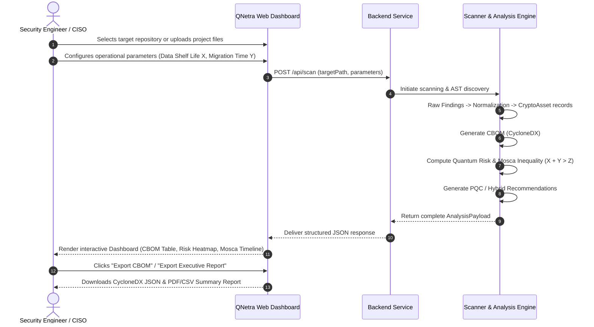

# 01 — Project Scope & Requirements Specification

> **DOCUMENT PURPOSE:** Defines the functional boundaries, requirements, inputs, outputs, user journeys, assumptions, and success criteria for **QNetra**. This document is the authority on WHAT QNetra builds.

---

## 1. Problem Understanding

Modern cybersecurity relies almost entirely on public-key cryptography (PKC) such as RSA, Diffie-Hellman (DH), and Elliptic Curve Cryptography (ECDH, ECDSA) for key exchange, identity verification, and digital signatures. 

However, with the rapid advancement of quantum computing:
* **Shor's Algorithm** can solve the prime factorization and discrete logarithm problems in polynomial time, completely breaking classical asymmetric cryptography.
* **Grover's Algorithm** offers quadratic speedup against symmetric ciphers and hashing, effectively halving the security level of AES and SHA-2 (requiring AES-256 and SHA-384/512 for quantum resistance).
* **Harvest Now, Decrypt Later (HNDL):** Nation-state threat actors are capturing and archiving encrypted traffic today. High-value data with long confidentiality lifespans ($X$) will be decrypted as soon as a Cryptographically Relevant Quantum Computer (CRQC) becomes operational ($Z$).

### The Enterprise Challenge
Enterprises lack visibility into:
1. Where cryptographic primitives, libraries, certificates, and hardcoded keys reside across heterogeneous code repositories and build artifacts.
2. Which assets are urgently vulnerable under the **Mosca Migration Inequality** ($X + Y > Z$).
3. How to construct a standards-compliant **Cryptographic Bill of Materials (CBOM)**.
4. How to select and migrate to **NIST Post-Quantum Cryptography (PQC)** standards (FIPS 203, 204, 205).

---

## 2. Core Objective

To engineer **QNetra**, an automated **Enterprise Cryptographic Discovery & Analysis Tool (ECDAT)** that scans application assets, produces standard-compliant CBOMs, quantifies quantum vulnerability risk, performs Mosca timeline simulations, and delivers actionable PQC / Hybrid migration roadmaps.

---

## 3. Official Problem Statement Requirements (SIH Alignment)

1. **Discovery Engine:** Automatically scan target source repositories, configuration files, and package manifests to detect cryptographic algorithms, cipher suites, key lengths, and implementations.
2. **CBOM Generator:** Aggregate discovered cryptographic assets into a machine-readable, standardized Cryptographic Bill of Materials (aligned with CycloneDX 1.6+).
3. **Risk Scoring Engine:** Deterministically classify cryptographic assets by vulnerability, quantum exposure (Shor vs. Grover impact), and legacy status.
4. **Mosca Assessment Engine:** Implement Michele Mosca’s migration inequality framework ($X + Y > Z$) to compute urgent exposure windows and calculate migration deadlines.
5. **PQC Migration Recommender:** Map vulnerable classical primitives to approved NIST PQC replacements (ML-KEM, ML-DSA, SLH-DSA) and hybrid schemes.
6. **Executive & Developer Reporting:** Deliver an intuitive visual dashboard with interactive risk heatmaps, timeline simulators, and exportable audit reports.

---

## 4. In Scope vs. Out of Scope

### In Scope (Current & Planned)
* **Static Code Analysis (SAST):** Scanning Python, JavaScript/TypeScript, Java, Go, C/C++ source code for cryptographic API calls, imports, and hardcoded keys.
* **Dependency & Manifest Parsing:** Scanning `package.json`, `requirements.txt`, `pom.xml`, `go.mod`, `Cargo.toml` for crypto library dependencies.
* **Artefact Normalization:** Canonical normalization of diverse scanner findings into a uniform `CryptoAsset` representation.
* **CycloneDX CBOM Export:** Exporting CBOMs in JSON/XML adhering to the CycloneDX 1.6+ Cryptography Extension.
* **Quantum Vulnerability Scoring:** Multi-factor risk calculation (Algorithm class, Key size, Deprecation status, Quantum vulnerability).
* **Mosca Timeline Simulation:** Dynamic user modeling where enterprise data shelf-life ($X$) and migration duration ($Y$) are simulated against quantum arrival horizons ($Z$).
* **PQC & Hybrid Mapping:** Deterministic rule-based recommendations for NIST FIPS 203/204/205 algorithms and transitional hybrid cipher suites.
* **Interactive Web Dashboard:** Modern visualization with vulnerability summaries, asset inventories, timeline graphs, and downloadable compliance reports.

### Out of Scope (Explicitly Excluded)
* **Automated Code Refactoring / Production Patching:** QNetra provides code recommendations and code snippets, but will *not* automatically modify or commit code to production repositories without human review.
* **Hardware Security Module (HSM) Key Extraction:** QNetra does not extract live private keys from HSMs or hardware enclaves.
* **Quantum Hardware Emulation / Physics Simulation:** QNetra analyzes cryptographic vulnerability, not quantum hardware physics.
* **Dynamic Kernel Memory Dumps / Live Process Hooking:** (Excluded from MVP to maintain lightweight, non-intrusive operations).

---

## 5. MVP Scope (Hackathon Deliverable)

The Minimum Viable Product concentrates on high-impact, demonstrable, fully functioning capabilities:

| Feature Area | MVP Deliverable | Status |
| :--- | :--- | :--- |
| **Ingestion** | Local folder/repository upload & target directory selection | Planned |
| **Source Scanning** | Static regex & AST scanning for Python, JS/TS, Java, and Go | Planned |
| **Dependency Scanning** | Detection of cryptographic packages in manifests (`package.json`, `requirements.txt`, `pom.xml`) | Planned |
| **Normalization** | Unified canonical `CryptoAsset` engine | Planned |
| **CBOM Engine** | CycloneDX 1.6+ JSON CBOM generation & download | Planned |
| **Risk Scoring** | Deterministic 4-tier risk matrix (Critical, High, Medium, Low) | Planned |
| **Mosca Engine** | Interactive $X + Y > Z$ migration calculator with configurable $X$, $Y$, $Z$ | Planned |
| **PQC Recommender** | Direct mapping from RSA/ECC/DH to ML-KEM/ML-DSA/SLH-DSA + Hybrid options | Planned |
| **Dashboard UI** | Interactive web UI with asset table, risk breakdown, Mosca visualizer, and export | Planned |

---

## 6. What Enters, Happens Inside, and Leaves the System

```
                  ┌────────────────────────────────────────────────────────┐
                  │                        INPUTS                          │
                  │  • Target Source Code Repositories                     │
                  │  • Dependency Manifests (package.json, pom.xml, etc.) │
                  │  • User Parameters (Data Shelf Life X, Migration Y)   │
                  │  • Quantum Threat Horizon Estimates (Z)                │
                  └───────────────────────────┬────────────────────────────┘
                                              │
                                              ▼
                  ┌────────────────────────────────────────────────────────┐
                  │                      PROCESSING                        │
                  │  1. Parse AST & Match Regex Patterns                   │
                  │  2. Identify Cryptographic Primitives & Parameters     │
                  │  3. Normalize into Canonical CryptoAsset Schema        │
                  │  4. Synthesize CycloneDX CBOM                          │
                  │  5. Calculate Deterministic Quantum Risk Scores        │
                  │  6. Evaluate Mosca Inequality (X + Y > Z)              │
                  │  7. Generate Context-Aware PQC / Hybrid Proposals      │
                  └───────────────────────────┬────────────────────────────┘
                                              │
                                              ▼
                  ┌────────────────────────────────────────────────────────┐
                  │                        OUTPUTS                         │
                  │  • CycloneDX 1.6+ CBOM (JSON / PDF / CSV)              │
                  │  • Cryptographic Risk & Quantum Vulnerability Scorecard│
                  │  • Mosca Migration Urgency Assessment & Gap Analysis   │
                  │  • PQC Replacement & Hybrid Migration Roadmap          │
                  │  • Interactive Visual Web Dashboard                    │
                  └────────────────────────────────────────────────────────┘
```

---

## 7. User Flow & Journey



---

## 8. Assumptions & Constraints

### Key Assumptions
* Target codebases contain accessible source files and dependency manifests in standard locations.
* The expected quantum threat horizon ($Z$) is a configurable variable (defaulting to 2030–2035 in alignment with NIST/BSI projections).
* Enterprise users can estimate the shelf-life of their sensitive data ($X$) and realistic software migration timelines ($Y$).

### Technical Constraints
* **Passive Inspection Only:** No execution of untrusted client code.
* **Low Latency:** Complete repository scanning and analysis should complete within seconds for standard codebases.
* **Cross-Platform:** Core engines and CLI/backends must operate seamlessly on Windows, Linux, and macOS.
* **Offline Capable:** Core discovery and risk engines must function without mandatory internet access (for secure/air-gapped environments).

---

## 9. Success Criteria & Metrics

1. **Discovery Precision & Recall:** $\ge 90\%$ detection rate of cryptographic primitives across standard benchmark test fixtures.
2. **CBOM Compliance:** 100% schema validity against the official CycloneDX 1.6 Cryptography JSON schema.
3. **Deterministic Explainability:** 100% of risk scores and Mosca calculations must provide traceable mathematical explanations.
4. **Performance:** Sub-10 second scan time for repositories with $< 100,000$ lines of code.
5. **Actionability:** Every identified vulnerable primitive must have at least one valid NIST-approved PQC or Hybrid migration path.

---

## 10. Requirement Traceability Matrix

| Requirement ID | Description | Target Module | Verification Method |
| :--- | :--- | :--- | :--- |
| **REQ-001** | Source Code Cryptographic Discovery | `scanners/source_scanner` | Unit test with known crypto code snippets |
| **REQ-002** | Dependency Manifest Discovery | `scanners/dependency_scanner` | Manifest parser unit tests |
| **REQ-003** | Universal Asset Normalization | `core/normalization` | Schema validation tests |
| **REQ-004** | CycloneDX 1.6 CBOM Generation | `core/cbom_generator` | CycloneDX JSON Schema validation |
| **REQ-005** | Quantum Vulnerability Risk Scoring | `core/risk_engine` | Test suite with high/low risk scenarios |
| **REQ-006** | Mosca Migration Assessment ($X+Y>Z$) | `core/mosca_engine` | Mathematical boundary condition tests |
| **REQ-007** | NIST PQC & Hybrid Recommendations | `core/recommendation_engine` | Rule-based mapping validation |
| **REQ-008** | Executive & Developer Dashboard UI | `frontend` | UI integration and end-to-end testing |
