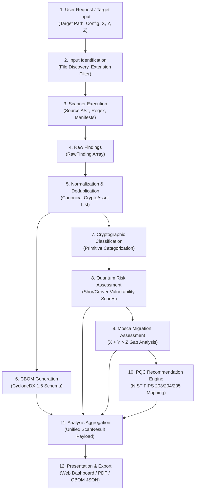

# 03 — Data Flow & Transformation Pipeline

> **DOCUMENT PURPOSE:** Traces the end-to-end lifecycle of information through **QNetra**, documenting every transformation step from raw repository ingestion to final report delivery.

---

## 1. End-to-End Data Pipeline Overview

---

## 2. Comprehensive Pipeline Stage Breakdown

| # | Stage Name | Input Data | Processing Details | Output Data | Responsible Module |
| :-: | :--- | :--- | :--- | :--- | :--- |
| **1** | **Target Ingestion & Routing** | `ScanTarget` (Path, Target Type, ScanOptions) | Validates path, detects target type via magic bytes & directory heuristics, dispatches to scanner. | Target routed to appropriate scanner | `scanners.framework.router` |
| **2** | **Target Traversal & File Filtering** | Repository root, container filesystem, or binary file | Recursively walks directories, applies exclusion patterns, enforces size limits, classifies file languages. | Filtered file sets grouped by language / format | `scanners.repository.traversal`, `scanners.utils` |
| **3** | **Multi-Target Scanner Execution** | Source files, container filesystem, or binary file | Executes AST analysis (Python), regex/import matching (JS, Java, C++), package inspection (dpkg/pip/npm), or binary inspection (lief/strings). | Unprocessed discovery events with locations and snippets | `scanners.repository`, `scanners.container`, `scanners.binary` |
| **4** | **Raw Findings Aggregation** | Discovery events from scanners | Calculates multi-signal confidence, attaches parameter hints, constructs `RawFinding` v1.1.0 records in `ScanResult`. | `ScanResult` (`List[RawFinding]`) | `scanners.framework` |
| **5** | **Normalization** | `List[RawFinding]` | Standardizes algorithm names, resolves aliases, merges duplicates, tags usage category. | `List[CryptoAsset]` | `core.normalization` |
| **6** | **CBOM Generation** | `List[CryptoAsset]` | Translates normalized assets into CycloneDX 1.6+ crypto components. | `CycloneDX_CBOM_JSON` | `core.cbom_generator` |
| **7** | **Classification** | `List[CryptoAsset]` | Categorizes primitives (Asymmetric, Symmetric, Hash, KDF, Protocol) and key parameters. | Classified `CryptoAsset` instances | `core.classification` |
| **8** | **Quantum Risk Scoring** | Classified `CryptoAsset` list | Computes vulnerability score based on Shor/Grover risk, key size, and deprecation. | `RiskAssessmentReport` | `core.risk_engine` |
| **9** | **Mosca Assessment** | `RiskAssessmentReport`, $X, Y, Z$ | Evaluates $X+Y > Z$ condition, calculates exposure gap, flags HNDL risk window. | `MoscaAssessmentReport` | `core.mosca_engine` |
| **10** | **PQC Recommendation** | Vulnerable assets, Risk & Mosca reports | Maps vulnerable primitives to NIST FIPS PQC and hybrid alternatives with migration steps. | `PQCRecommendationReport` | `core.recommendation_engine` |
| **11** | **Result Aggregation** | CBOM, Risk, Mosca, Recommendations | Assembles all subsystem outputs into a single canonical scan result envelope. | `CompleteScanResult` | `backend.controllers` |
| **12** | **Delivery & Export** | `CompleteScanResult` | Transmits JSON to UI, generates interactive charts, exports downloadable CBOM/PDF. | Web UI / Export files | `frontend`, `backend.export_service` |

---

## 3. Detailed Step-by-Step Data Transformations

### Step 3.1: Raw Scanner Output to Normalized `CryptoAsset`
* **Input:** Language-specific raw scanner findings (e.g. `{"func": "RSA.generate", "args": [2048], "file": "auth.py", "line": 42}`).
* **Transformation:**
  1. Map `"RSA.generate"` -> Algorithm: `RSA`, Function: `KeyGeneration`.
  2. Parse key length `2048`.
  3. Assign Primitive Category: `Asymmetric / Public-Key Encryption & Signature`.
  4. Quantum Security Rating: `Vulnerable (Shor's Algorithm - Polynomial Time Break)`.
* **Output:** Strongly-typed `CryptoAsset` record.

### Step 3.2: Normalized Assets to CycloneDX 1.6 CBOM
* **Input:** `List[CryptoAsset]`.
* **Transformation:** Formats components under the CycloneDX `crypto-asset` schema, assigning unique BOM-refs, algorithm identifiers, and security levels.
* **Output:** Standards-compliant CycloneDX 1.6 JSON document.

### Step 3.3: Assets & Parameters to Mosca Inequality Evaluation
* **Input:**
  * Sensitive data shelf life $X$ (e.g. 10 years).
  * System migration duration $Y$ (e.g. 3 years).
  * Estimated quantum threat horizon $Z$ (e.g. 8 years until CRQC).
* **Transformation:**
  * Evaluate inequality: $X + Y = 10 + 3 = 13 > 8$ ($X + Y > Z$).
  * Compute Vulnerability Gap: $(X + Y) - Z = 5$ years of exposed data.
  * Trigger Harvest Now, Decrypt Later (HNDL) alert.
* **Output:** `MoscaAssessmentReport` containing timeline boundaries and urgency rating.

### Step 3.4: Asset Context to PQC Recommendation
* **Input:** Asset `RSA-2048` used for Digital Signatures.
* **Transformation:**
  * Identify NIST standard: FIPS 204 (**ML-DSA** / Dilithium) or FIPS 205 (**SLH-DSA** / SPHINCS+).
  * Propose Hybrid alternative: `RSA-2048 + ML-DSA-65` for backward-compatible transitional phase.
  * Provide implementation snippet and estimated migration complexity.
* **Output:** `PQCRecommendationItem`.

---

## 4. Invariants & Data Integrity Rules

1. **No Data Loss during Normalization:** All raw finding attributes (file path, line number, code snippet context) must be preserved in the normalized asset record.
2. **Schema Uniformity:** Downstream analytics engines only accept normalized `CryptoAsset` structures, never raw scanner outputs.
3. **Idempotence:** Scanning the exact same repository with the same parameters must yield identical CBOM and risk payloads.
4. **Zero State Pollution:** Separate scans must never leak findings or state into subsequent scans.

---

## 5. Error Handling & Edge Case Flows

| Failure Mode | Trigger Condition | System Behavior |
| :--- | :--- | :--- |
| **Unparseable Source File** | Syntax error in scanned code | Log warning, record `ScanAnomaly`, skip unparseable block, continue scanning remaining files. |
| **Unknown Cryptographic Primitive** | Proprietary or obscure crypto API call | Flag as `UnknownAlgorithm`, set risk to `High (Unverified Primitive)`, record for manual triage. |
| **Missing User Parameters** | User omits $X$ or $Y$ in Mosca analysis | Default to conservative industry baselines ($X=10$ yrs, $Y=3$ yrs, $Z=7$ yrs) with notification. |
| **Empty Scan Target** | Target directory contains no code | Return empty asset list with status `COMPLETED_NO_CRYPTO_FOUND`. |
